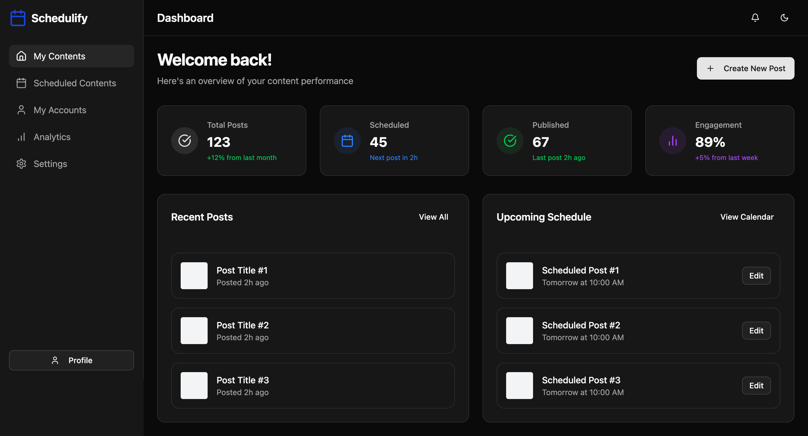

## 📋 Overview

Shcedulify is a comprehensive social media content management platform that helps you plan, schedule, and analyze your social media content across multiple platforms. Built with React and Django, it offers a modern and intuitive interface for efficient social media management.

  

## ✨ Features
- 📱 **Multi-Platform Support** - Manage content for multiple social media platforms in one place
- 📅 **Content Calendar** - Visual calendar interface for content planning
- 📊 **Analytics Dashboard** - Track performance metrics and engagement
- 🎨 **Modern UI/UX** - Clean and intuitive interface with dark mode support
- 🔄 **Real-time Updates** - Live content status and analytics updates

## 🎯 Roadmap

- [ ] Integration with social media platforms
- [ ] AI-powered content suggestions
- [ ] Team collaboration features
- [ ] Advanced analytics and reporting
- [ ] Custom content templates

## 🤝 Contributing

Contributions are welcome! Feel free to check out our [Contributing Guidelines](CONTRIBUTING.md).

## 📄 License

This project is licensed under the MIT License - see the [LICENSE](LICENSE) file for details.

## 📞 Contact

If you have any questions or feedback, feel free to reach out:

- Email: olgudegirmenci34@gmail.com

  Made with ❤️ by OlguD

